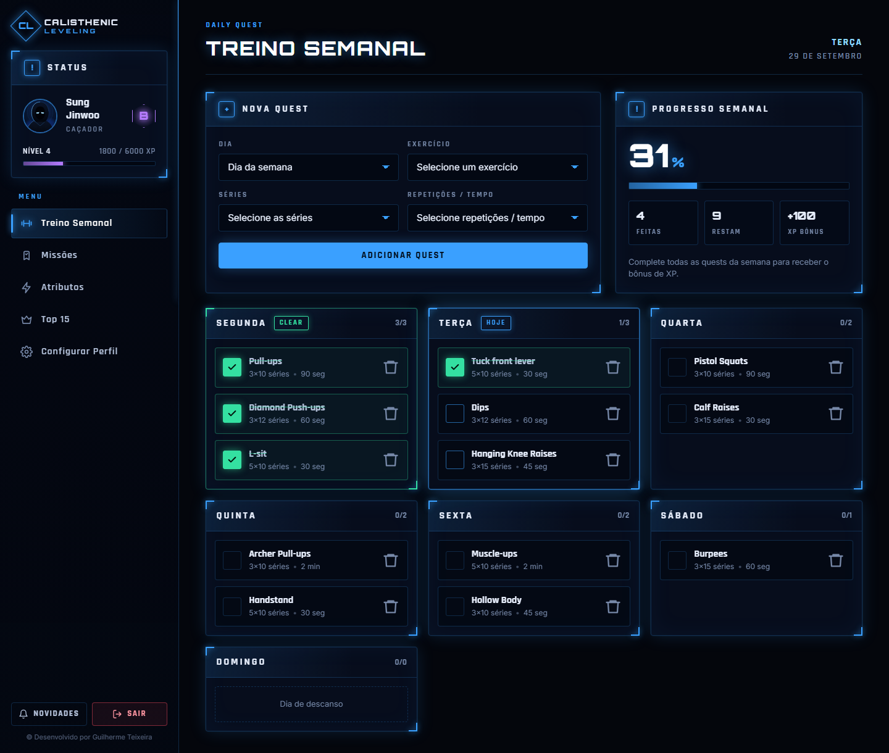
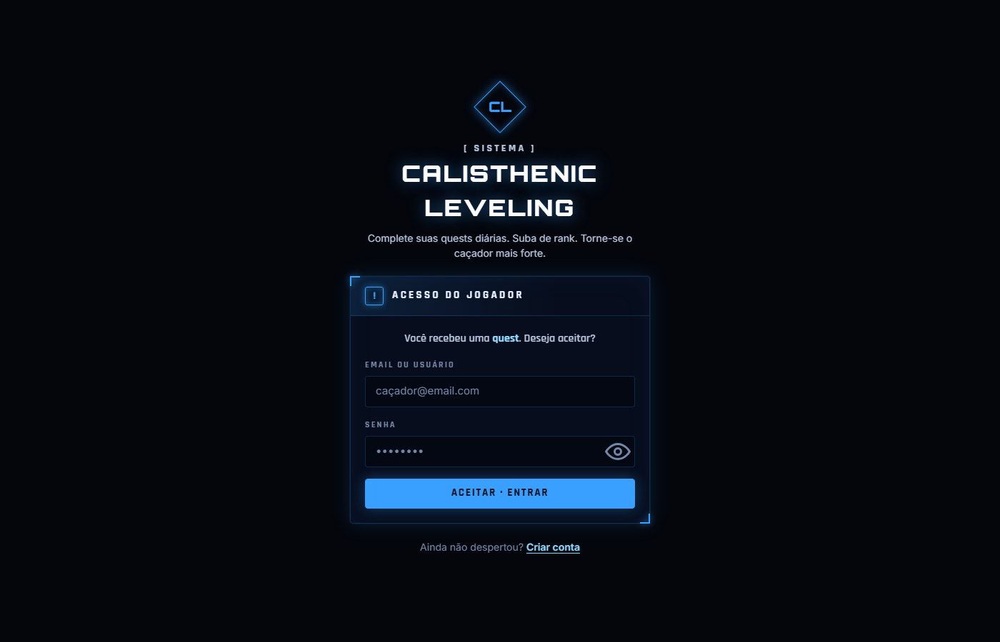
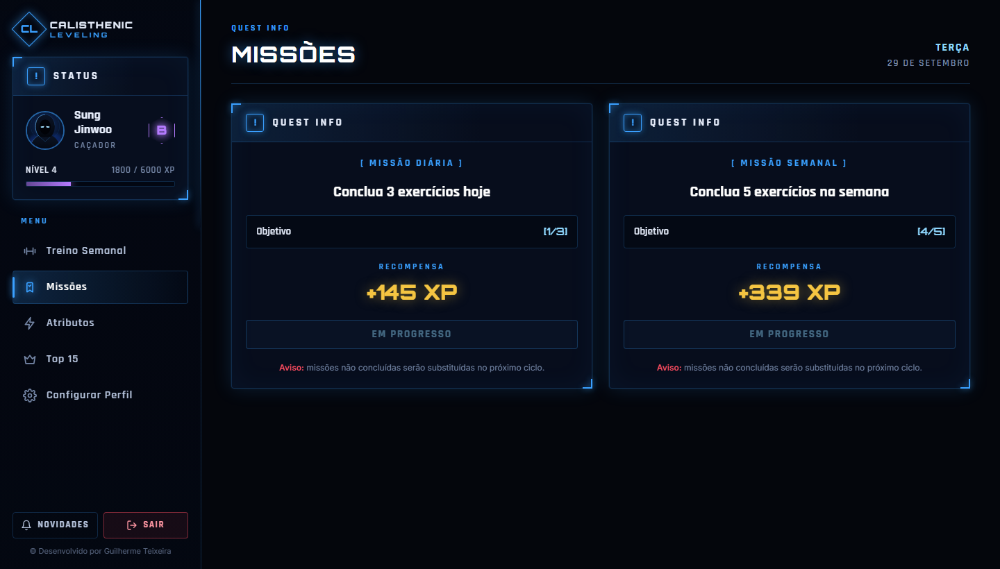
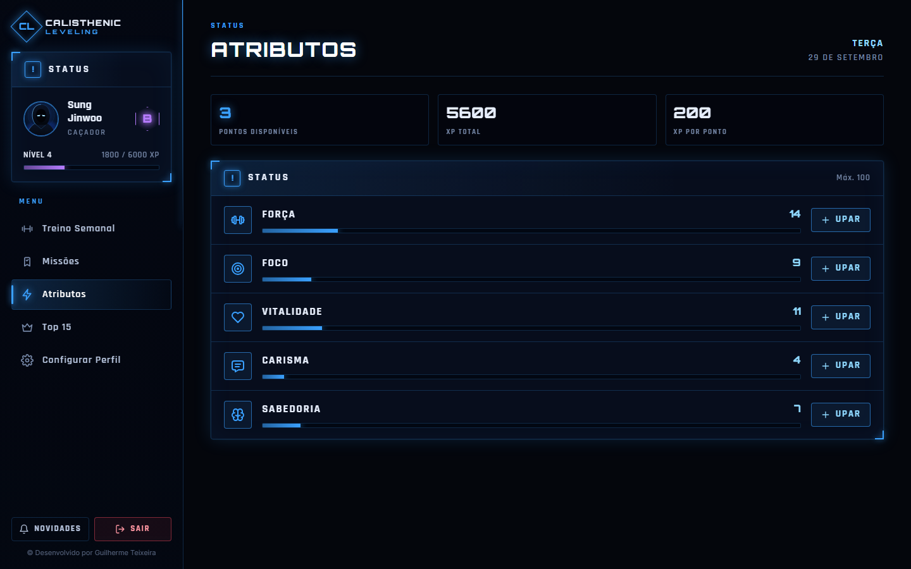
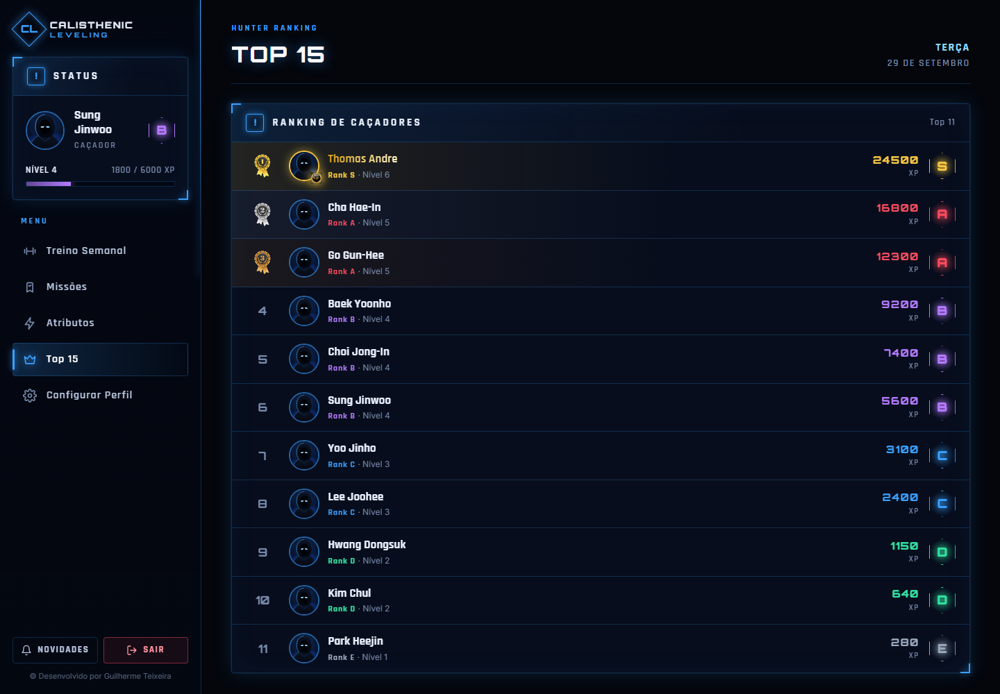
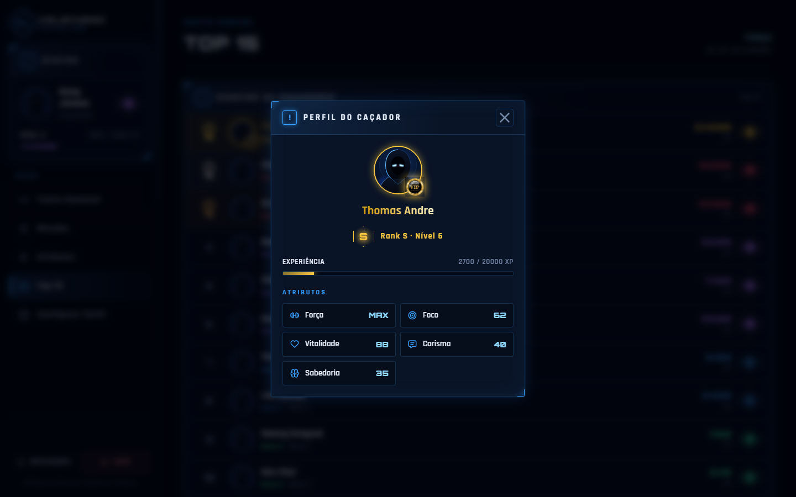
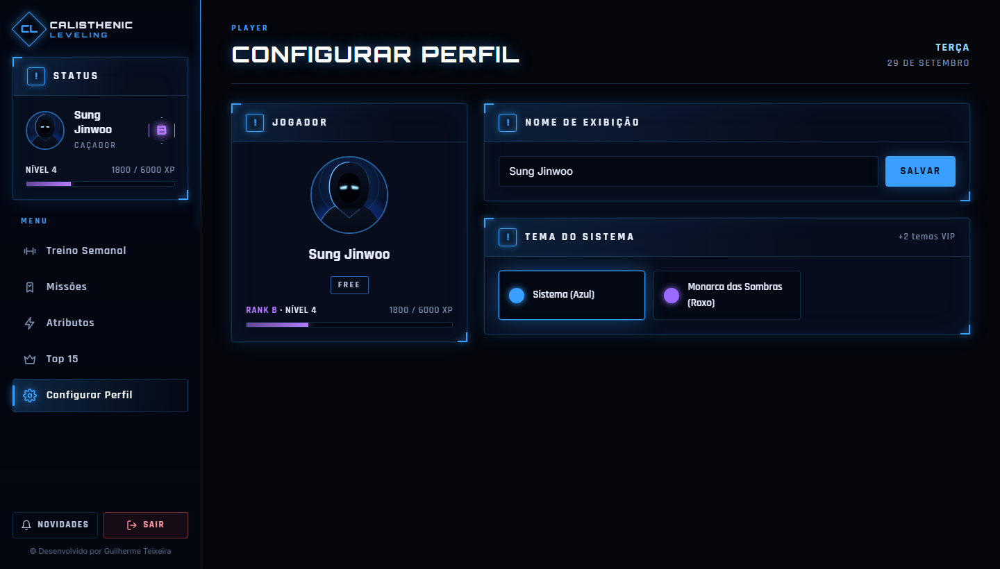
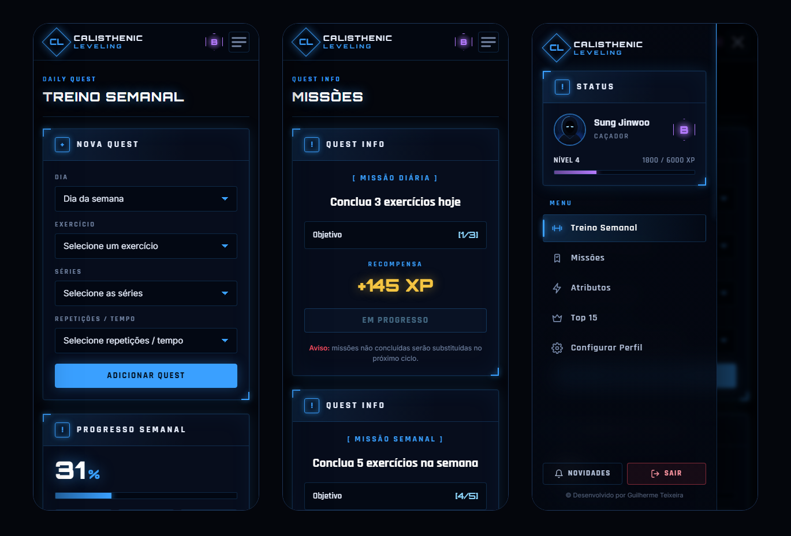

# Calisthenic Leveling

Calisthenic Leveling is a web app that turns **calisthenics training** into an RPG-style progression system, with an interface inspired by the "System" windows from the anime **Solo Leveling**. Plan your weekly workouts as quests, complete them day by day, earn XP, rank up from E to S and level up your attributes.

<p align="center">
  
</p>

---

## 📸 Screenshots

> The screenshots use sample data.

| Login | Missions |
| :---: | :---: |
|  |  |
| **Attributes (Status)** | **Top 15 Ranking** |
|  |  |
| **Hunter Profile** | **Profile Settings** |
|  |  |

<p align="center">
  <b>Mobile</b><br />
  
</p>

---

## 🌟 Features

- **Weekly Training (Daily Quests)**: Build your week by choosing an exercise, sets and reps/time for each day. More than 60 exercises are available, from push-ups to front and back lever progressions. A quest can only be completed on its own day, and progress resets every Monday.
- **Weekly Progress**: Shows how much of the week is done, with a bonus XP reward when every quest is completed.
- **Missions (Quest Info)**: One daily and one weekly mission, each with a live goal counter (`[2/3]`) and an XP reward you claim once it's complete.
- **Ranks & Levels**: Climb through ranks **E → D → C → B → A → S**. Each rank has its own color and hexagonal badge.
- **Attributes (Status)**: XP turns into upgrade points that you spend on Strength, Focus, Vitality, Charisma and Wisdom.
- **Top 15 Hunter Ranking**: A live leaderboard with podium highlights. Click a player to open their profile.
- **Profile Settings**: Change your display name, avatar and System theme.
- **Themes**: *System* (blue) and *Shadow Monarch* (purple) for everyone. *Golden Monarch* and *Awakening* are VIP-only.
- **System Notifications**: Toast alerts about other hunters' achievements.
- **Responsive**: A desktop sidebar that turns into a slide-in drawer on mobile.

---

## 🎨 Design

The UI is built around the idea of a **System window**:

- Translucent dark panels with glowing borders and corner brackets
- `[!] QUEST INFO`–style headers, with fonts **Orbitron**, **Rajdhani** and **Inter**
- A holographic grid background with a blue portal glow
- Theme colors defined as CSS custom properties, switched with `data-theme` on `<html>`
- An original default avatar, a hooded "Shadow Monarch" silhouette, used when a user has no photo or their photo fails to load

---

## 🛠️ Tech Stack

- **React 19** (Create React App)
- **Firebase** Authentication and Cloud Firestore
- **CSS3** with custom properties (no UI framework)
- **gh-pages** for deployment to GitHub Pages

---

## 📁 Project Structure

```
src/
├── App.js                # Layout, navigation and the weekly training screen
├── firebase.js           # Firebase initialization
├── global.css            # Imports every stylesheet
├── css/                  # base (tokens, panels, buttons), layout, and one file per screen
├── components/           # Sidebar, TaskForm, TaskItem, Missoes, Upgrade, Top15, perfilcfg, ...
├── constants/xpPorRank.js
├── utils/                # rankUtils, theme, avatar
└── assets/               # Attribute icons, medals, VIP badge, default avatar
```

---

## 🚀 Getting Started

**Requirements:** Node.js 18 or newer.

```bash
git clone https://github.com/guilhermeteixeira01/calisthenic-leveling.git
cd calisthenic-leveling
npm install
npm start
```

The app runs at `http://localhost:3000`.

To use your own Firebase project, replace the `firebaseConfig` object in `src/firebase.js`. The project needs **Email/Password Authentication** and **Cloud Firestore** turned on.

### Scripts

| Command          | Description                          |
| ---------------- | ------------------------------------ |
| `npm start`      | Starts the development server        |
| `npm run build`  | Creates a production build in `build/` |
| `npm test`       | Runs the tests                       |
| `npm run deploy` | Builds the app and publishes it to GitHub Pages |

---

## 📄 License

Distributed under the license in [LICENSE](LICENSE).

*Solo Leveling is the property of its respective owners. This is a fan-inspired, non-commercial project.*
